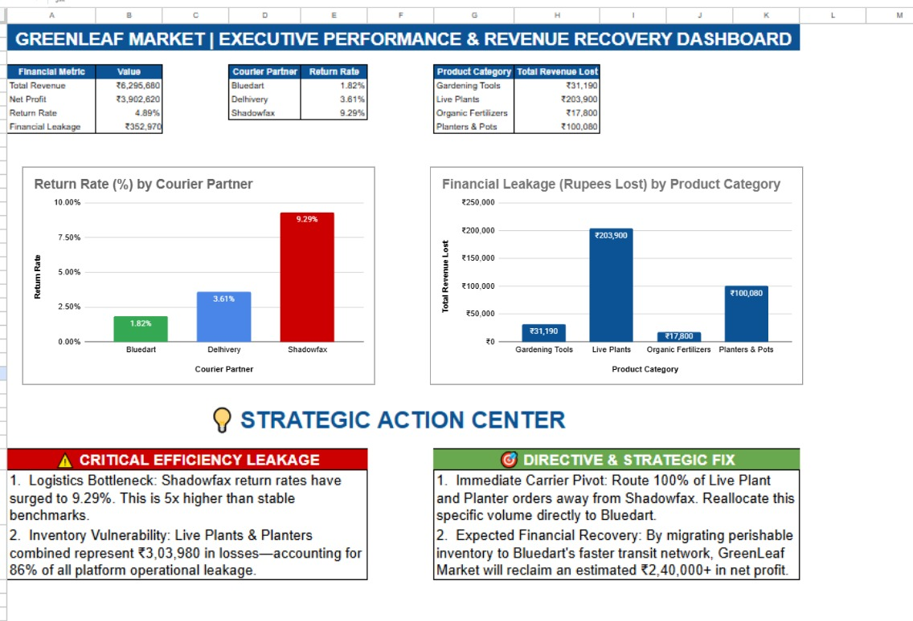

# GreenLeaf Market | Executive Performance & Revenue Recovery Dashboard

## Project Links
- 📊 Live Dashboard (Google Sheets): [View Dashboard](https://docs.google.com/spreadsheets/d/1wLRA-gia_mQFnJnWGKiCArVACQkchETd426_ynd8ra4/edit?gid=489402324#gid=489402324)

---

## Project Overview

GreenLeaf Market was experiencing increasing product returns and operational losses across courier partners and product categories. This project analyzes **10,000+ order records** to identify revenue leakage, courier inefficiencies, and profitability gaps — and delivers an executive dashboard with strategic recovery recommendations.

---

## Business Problem

GreenLeaf Market's overall **return rate stood at 4.89%**, resulting in **₹3,52,970 in financial leakage** against total revenue of **₹62,95,680**. Leadership needed clarity on:

- Which courier partners were driving the highest return rates
- Which product categories were bleeding the most revenue
- What actions could recover profitability

---

## Dashboard Preview

---

## Key Insights

### 💸 Financial Overview
| Metric | Value |
|---|---|
| Total Revenue | ₹62,95,680 |
| Net Profit | ₹39,02,620 |
| Return Rate | 4.89% |
| Financial Leakage | ₹3,52,970 |

### 🚚 Courier Performance
| Courier Partner | Return Rate |
|---|---|
| Bluedart | 1.82% ✅ Lowest |
| Delhivery | 3.61% |
| Shadowfax | 9.29% ❌ Highest |

Shadowfax's return rate is **5x higher than Bluedart** — the single biggest operational risk.

### 📦 Revenue Leakage by Product Category
| Category | Revenue Lost |
|---|---|
| Live Plants | ₹2,03,900 |
| Planters & Pots | ₹1,00,080 |
| Gardening Tools | ₹31,190 |
| Organic Fertilizers | ₹17,800 |

Live Plants and Planters & Pots together account for **86% of total financial leakage**.

### 🎯 Strategic Recommendation
- Redirect all Live Plant and Planter orders away from Shadowfax to Bluedart
- Estimated profit recovery: **₹2,40,000+**
- Trigger return-rate alerts when any courier exceeds 5% threshold

---

## Tools & Technologies
`Advanced Excel` `Google Sheets` `Pivot Tables` `Pivot Charts` `KPI Cards` `Dashboard Design` `Business Analytics`

---

## Dataset
10,000+ order records including Product Category, Courier Partner, Revenue, Return Status, Profit Metrics, and Operational Performance Indicators.

---

## Files Included

| File | Description |
|---|---|
| GreenLeaf Market - Operations Analytics Dashboard - Dashboard.pdf | Dashboard Report |
| GreenLeaf_Market_10k_Orders.csv | Source Dataset |
| green_leaf_market_dashboard.jpeg | Dashboard Preview |

---

## Author
**Harshitha S** — Aspiring Data Analyst
[LinkedIn](https://www.linkedin.com/in/harshitha-s-167639256) | [GitHub](https://github.com/Harsh-itha2001)
